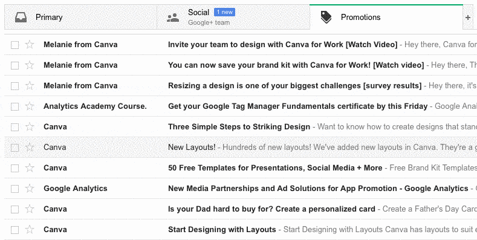

1. Open your inbox, and find an email from us. It will have **@digitalmarketingspecialist.co.uk** in the address.
2. Right click, and pick 'Move to tab > Primary'.   
3. Click 'Yes' in the notice.

Now you'll see your emails in the Primary tab!
