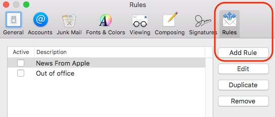
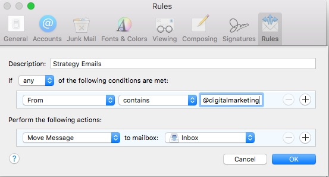

When opening an email message, a “+” symbol should display next to From: and the sender’s name. Select this and an “Add to contacts” pop-up should appear. Select “Save”:

1. In the menu bar, click **Mail > Preferences**. This will open the preferences window.
2. Click the **Rules** icon on the far right, then the **Add Rule** button.   
4. Add the following rule:

<em>
**Description:** Strategy Emails

If **any** of the following conditions are met:

**From Contains @digitalmarketing**

Perform the following actions:

**Move Message** to mailbox: **Inbox**

</em>

It should look like this:

Click **save**. Now you'll see your emails when they arrive!

Need some help? Feel free to contact me.